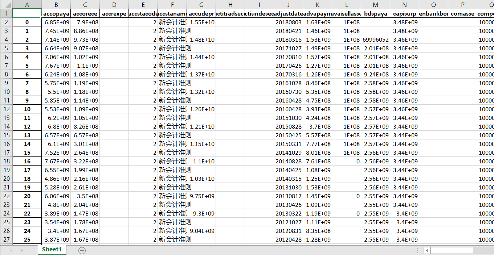
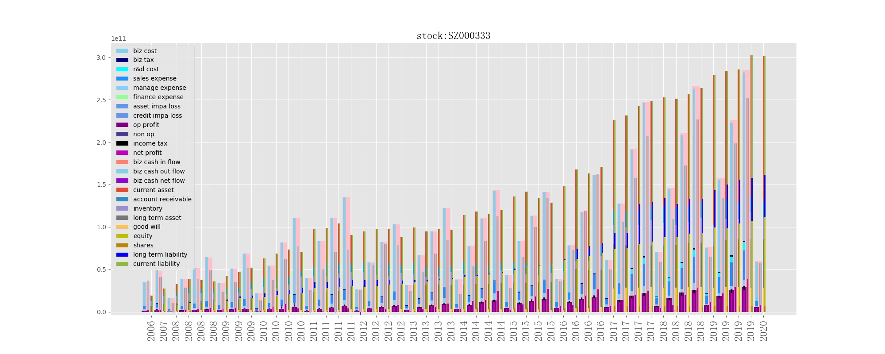

# 雪球爬虫
# How to run
- run main/f10_main.py  
  - 获取行业所有报表，横向纵向比较
- run main/price_main.py
  - 获取今天的价格，成交量
- 如果雪球拒绝，请更改xueqiu.py的header(打开chrome访问雪球 F12)

## API
- https://xueqiu.com/stock/forchart/stocklist.json?symbol=SH600519&period=1d&one_min=1
- https://xueqiu.com/stock/forchartk/stocklist.json?symbol=SH600519&period=1week&type=normal&begin=1385706304210&end=1511850304210
- https://xueqiu.com/stock/pankou.json?symbol=SH600519
- https://xueqiu.com/stock/forchartk/stocklist.json?symbol=SH600519&period=1d&type=normal&begin=1385706304210&end=1511850304210
- https://xueqiu.com/stock/forchartk/stocklist.json?symbol=SH600519&period=1week&type=normal&begin=1385706304210&end=1511850304210
- https://xueqiu.com/stock/industry/stockList.json?code=SZ000333&type=1&size=100

# 可视化

## 资产负债表
run chart/bs_chart.py
## 利润表和现金流量表
run ana/is_cfs_chart.py
## 个股
run f10_stock.py

## 行业
run f10_main.py

- 先看利润，利润都不好看的基本面肯定不好
- 看现金流量表，利润好看，但是经营现金流净额经常负一下的估计也不好
- 看看销售收入是不是稳步增长
- 看看毛利率怎么样
- 看应收、存货、商誉
# 未完待续。。。
## 银行，金融
## ROE ROA SR/A NI/SR
